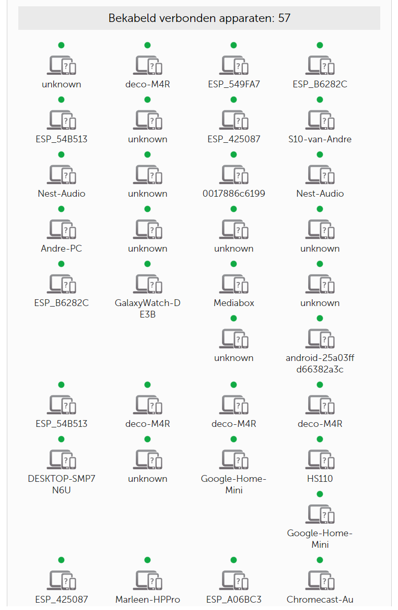
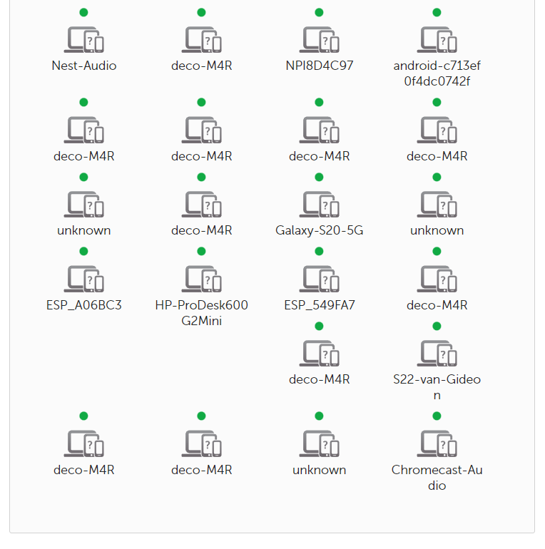
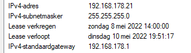
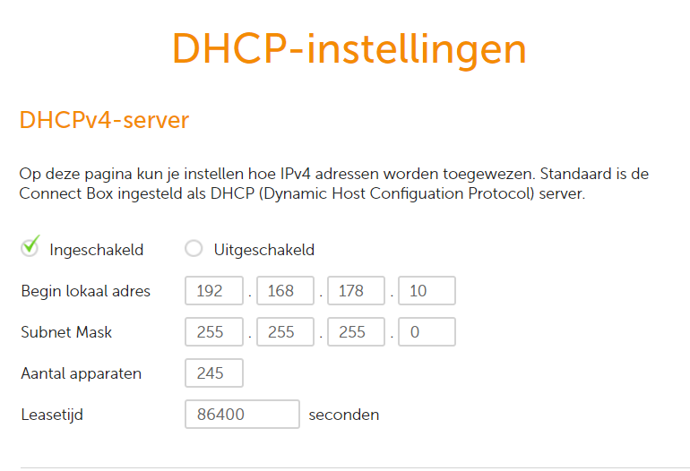

Network Devices

There are different types of electronic devices are used in networking which are known as network devices or network equipment. In a computer network, network devices are mainly used for transmitting and receiving the data quickly and securely in between computers, fax machines, printers, etc.

## Key terminology
Hardware that operates in a network. A "network" device is a component that makes up the network infrastructure such as modems, routers and switches. A "networked" device on the other hand refers to equipment that connects to a network, which includes computers, printers and most A/V gear (receivers, media hubs and servers, Blu-ray players, etc.), which operate in an Ethernet or Wi-Fi network or both. Smartphones and tablets all have Wi-Fi but are considered.

The different types of network devices used in a computer network.

-Network Hub

-Network Switch

-Modem

-Network Router

-Bridge

-Repeater,et cetera

## Exercise

- Describe the functions of common networking devices
- Get a list of all the connected devices of your router
- What other information has the router on the connected devices
- Locate your DHCP server on your network and check it's configurations

Network Hub

The network hub is one kind of networking device in a computer network, used to communicate with various network hosts and also for data transferring. The transferring of data in a computer network can be done in the form of packets. Whenever the data processing can be done from a host to a network hub, then the data can transmit to all the connected ports. Similarly, all the ports identify the data path which leads to inefficiencies & wastage. Because of this working, a network hub cannot be so safe and secure. In addition, copying the data packets on all the ports will make the hub slower which leads to the utilize of the network switch.

Network Switch

Similar to a hub, this is also working at the layer in the LAN and a switch is more clever compare with a hub. As the hub is used for data transferring, whereas a switch is used for filtering & forwarding the data. So this is the more clever technique to deal with the data packets.
Whenever a data packet is obtained from the interfaces in the switch, then the data packet can be filtered & transmits to the interface of the proposed receiver. Due to this reason, a switch maintains a content addressable memory table to maintain system configuration as well as memory. This table is also named as FIB (forwarding information base) otherwise forwarding table.

Modem

A modem is the most important network device and it is used daily in our life. If we notice the internet connection to homes was given with the help of a wire. then wire carries internet data from one place to another. But, every computer gives digital or binary data in the form of zeros & ones.
The full form of the modem is a modulator and a demodulator. So it modulates as well as demodulates the signal among the computer and a telephone line because the computer generates digital data whereas the telephone line generates an analog signal.

Network Router

A network router is one kind of network device in a computer network and it is used for routing traffic from one network to another. These two networks could be private to a public company network. For example, here a router is considered as traffic police at the junction, he directs dissimilar traffic networks to dissimilar directions.

Bridge

A Bridge in the computer network is used to unite two or more network segments. The main function of a bridge in network architecture is to store as well as transmit frames among the various segments. Bridges use MAC (Media Access Control) hardware for transferring frames.
hese are also used for connecting two physical local area networks to a larger logical local area network. In the OSI model, bridges work at the data link & physical layers to divide the networks from larger to smaller by controlling the data flow between the two. In recent years, bridges are replaced by switches to provide more functionality.

Repeater

The operating of a repeater can be done at the physical layer. The main function of this device is to reproduce the signal on a similar network before the signal gets weak otherwise damaged. The significant point to be noted regarding these devices is that they do not strengthen the signal. Whenever the signal gets weak, then they reproduce it at the actual strength. A repeater is a two-port device.

Et Cetera.

### Sources
[1e-NetworkDevice](https://www.pcmag.com/encyclopedia/term/network-device)

[What-are-Network-Devices-and-Their-Types](https://www.elprocus.com/what-are-network-devices-and-their-types/)

### Overcome challanges
- It is always wise to know exactly how your network works and which devices are connected to it.
- See all the connected devices to the router
- Find out what the different devices are and what they do
- Find out what my IP-adres at the moment is
- Find the way for acces to my modem/router

### Results
- I have seen all the connected devices to the my modem/router
- I found out what the different devices are and what they do
- I found out what my IP-adres at the moment is
- I found the way for acces to my modem/router

