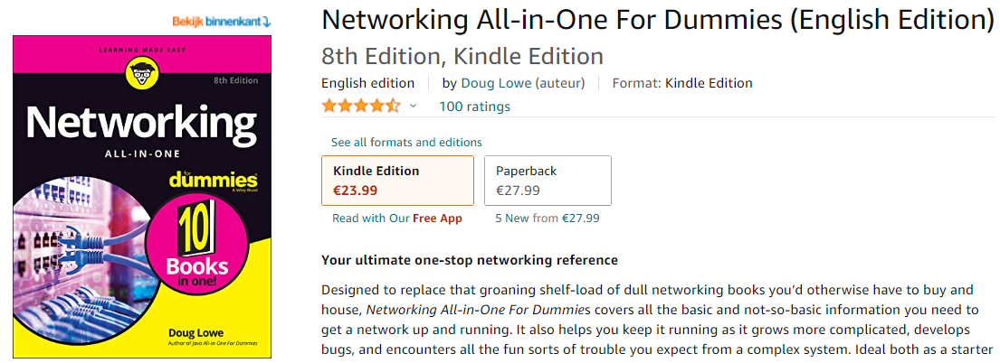

## Protocols

What is a network protocol?

Network protocols regulate data exchange in computer networks. They define the necessary rules for tasks such as addressing data packets, switching data packets, transporting data packets, establishing a connection or error checking. Important network protocols for the Internet can be found in the IP protocol family.

A protocol is a set of rules that enables effective communications to occur. You encounter protocols every day.

For example, when you pay for groceries with a debit card, the clerk first tells you how much the groceries cost. You then swipe your debit card in the card reader, punch in your security code, indicate whether you want cash back, enter the amount of the cash back if you so indicated, then verify the total amount. Assuming the amount is authorized, the machine prints out your receipt.

The typical tasks of a network protocol include:

- Establishing a connection between the computers involved
- Reliable delivery of the data packets to the desired recipient
- Routing of data packets through the network
- Specification of the data format
- Definition of the addressing and the address format
- Ensuring the error-free transmission of the data packets
- Ensuring the correct order of incoming data packets
- Preventing unauthorized access to data through encryption
- Preventing the manipulation of data, for example through electronic signatures

## Key terminology
There are various types of protocols that support a major and compassionate role in communicating with different devices across the network. These are:
- Transmission Control Protocol (TCP)
- Internet Protocol (IP)
- User Datagram Protocol (UDP)
- Post office Protocol (POP)
- Simple mail transport Protocol (SMTP)
- File Transfer Protocol (FTP)
- Hyper Text Transfer Protocol (HTTP)
- Hyper Text Transfer Protocol Secure (HTTPS)
- Telnet
- Gopher

#1 Transmission Control Protocol (TCP):

 TCP is a popular communication protocol which is used for communicating over a network. It divides any message into series of packets that are sent from source to destination and there it gets reassembled at the destination.

#2 Internet Protocol (IP):

 IP is designed explicitly as addressing protocol. It is mostly used with TCP. The IP addresses in packets help in routing them through different nodes in a network until it reaches the destination system. TCP/IP is the most popular protocol connecting the networks.

#3 User Datagram Protocol (UDP):

 UDP is a substitute communication protocol to Transmission Control Protocol implemented primarily for creating loss-tolerating and low-latency linking between different applications.

#4 Post office Protocol (POP):

 POP3 is designed for receiving incoming E-mails.

#5 Simple mail transport Protocol (SMTP):

 SMTP is designed to send and distribute outgoing E-Mail.

#6 File Transfer Protocol (FTP):

 FTP allows users to transfer files from one machine to another. Types of files may include program files, multimedia files, text files, and documents, etc.

#7 Hyper Text Transfer Protocol (HTTP):

 HTTP is designed for transferring a hypertext among two or more systems. HTML tags are used for creating links. These links may be in any form like text or images. HTTP is designed on Client-server principles which allow a client system for establishing a connection with the server machine for making a request. The server acknowledges the request initiated by the client and responds accordingly.

#8 Hyper Text Transfer Protocol Secure (HTTPS):

 HTTPS is abbreviated as Hyper Text Transfer Protocol Secure is a standard protocol to secure the communication among two computers one using the browser and other fetching data from web server. HTTP is used for transferring data between the client browser (request) and the web server (response) in the hypertext format, same in case of HTTPS except that the transferring of data is done in an encrypted format. So it can be said that https thwart hackers from interpretation or modification of data throughout the transfer of packets.

#9 Telnet:

 Telnet is a set of rules designed for connecting one system with another. The connecting process here is termed as remote login. The system which requests for connection is the local computer, and the system which accepts the connection is the remote computer.

#10 Gopher:

 Gopher is a collection of rules implemented for searching, retrieving as well as displaying documents from isolated sites. Gopher also works on the client/server principle.

## Exercise

- Identify several other protocols and their associated OSI layer. Name at least one for each layer.

- Figure out who determines what protocols we use and what is needed to introduce your own protocol.

- Look into wireshark and install this program. Try and capture a bit of your own network data. Search for a protocol you know and try to understand how it functions.

#1 

Protocols: NFS, NIS+, DNS, telnet, ftp, rlogin, rsh, rcp, RIP, RDISC, SNMP, and others

OSI Ref. Layer No. :  5 (Application), 6 (Session), 7 (Presentation)

Protocols: TCP, UDP

OSI Ref. Layer No. : 4 (Transport)

Protocols: IP, ARP, ICMP

OSI Ref. Layer No. : 3 (Network)

Protocols: PPP, IEEE 802.2

OSI Ref. Layer No. : 2 (Data link)

Protocols: Ethernet (IEEE 802.3) Token Ring, RS-232, others  

OSI Ref. Layer No. : 1 (Physical)

#2/1 

World Wide Web Consortium (W3C) - Many of the internet standards we know, like HTML, XHTML, CSS, XML, and many more, have been proposed, discussed, defined, and formalized by the W3C.

Telecommunication Standardization Sector (ITU-T) - The International Telecommunication Union – Telecommunication Standardization Bureau (ITU-T) is the division of the ITU responsible for standards in the telecommunications and information communications (ICTs) technology sectors.

Internet Architecture Board (IAB) - The Internet Architecture Board (IAB) is an organization established both as a commission of the Internet Engineering Task Force (IETF) and as an advisory body of the Internet Society (ISOC).

#2/2

What is needed to introduce your own protocol.

[Creating a custom protocol](https://www.websense.com/content/support/library/web/v82/triton_web_help/add_protocol_explain.aspx)

#3

Wireshark

## Sources
[Was-ist-ein-Netzwerk-Protokoll?](https://www.ip-insider.de/was-ist-ein-netzwerk-protokoll-a-711459/#:~:text=Definition%20Was%20ist%20ein%20Netzwerk%2DProtokoll%3F&text=Netzwerk%2DProtokolle%20regeln%20den%20Datenaustausch,den%20Verbindungsaufbau%20oder%20die%20Fehler%C3%BCberpr%C3%BCfung.)

[Types-of-Network-Protocols-and-their-uses](https://www.w3schools.in/types-of-network-protocols-and-their-uses)

[Who creates the standards and protocols for the internet?](https://www.internetx.com/en/news-detailview/who-creates-the-standards-and-protocols-for-the-internet/)

[Wireshark](https://www.wireshark.org/#download)

Overcome challanges
Finding the right information

I bought the book "Networking for Dummies" at Amazon,and have read it.
