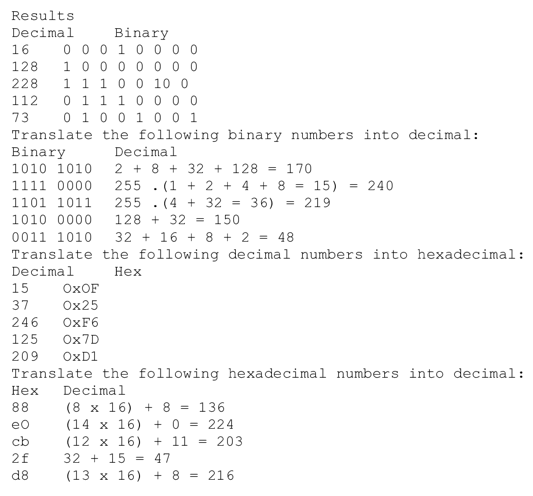

## Counting in Binary and Hexadecimal

Computers store information in bits. bits can have a electrical current (1) or not (0). Because computers can store only 2 'values' in a bit, the binary system is used. A sequence of 8 bits is a byte.
Starting from the right, the numerical value of that bit is 2^0 = 1. The bit to the left of it 2^1 = 2, then 2^2 = 4, 2^3 = 8 etc etc. This way you can combine a certain sequence of bits to make longer numbers.

Hexadecimal is counting up to 16 (0-15) by using ABCDEF after the numbers. This is easier to read for humans.

To distinquish hexadecimal from decimal, a 0x is usually added in front.
Hexadecimal notation is recognisable from for example, HTML color selection. (#FFFFFF for white)

## Key terminology
You should know a thing or two about decimal numbers before delving into this tutorial. Remember long division? Remainders? Quotients? Products? Sums? Exponents? Those all come back to haunt you when you're learning about hexadecimal and its relationship to decimal.

## Exercise

 
### Sources
[Key terminology of Counting in Binary and Hex](https://learn.sparkfun.com/tutorials/hexadecimal/all)

[Binary and Hex Tutorial](https://condor.depaul.edu/sjost/lsp121/documents/binary-tutorial.htm)

[Hexadecimal](https://learn.sparkfun.com/tutorials/hexadecimal/all)

[How To Convert Binary to Hexadecimal](https://www.youtube.com/watch?v=tSLKOKGQq0Y)

### Overcome challanges
Finding the right information

I bought the book "Counting in Binary and Hexadecimal for Dummies" at Amazon,and have read it.

