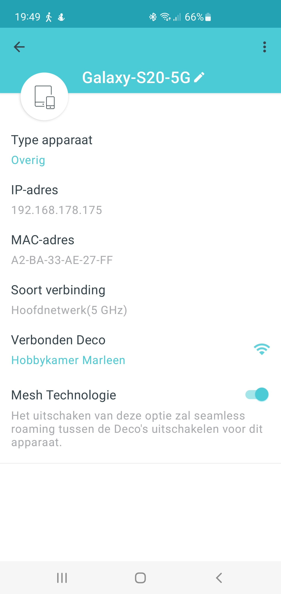
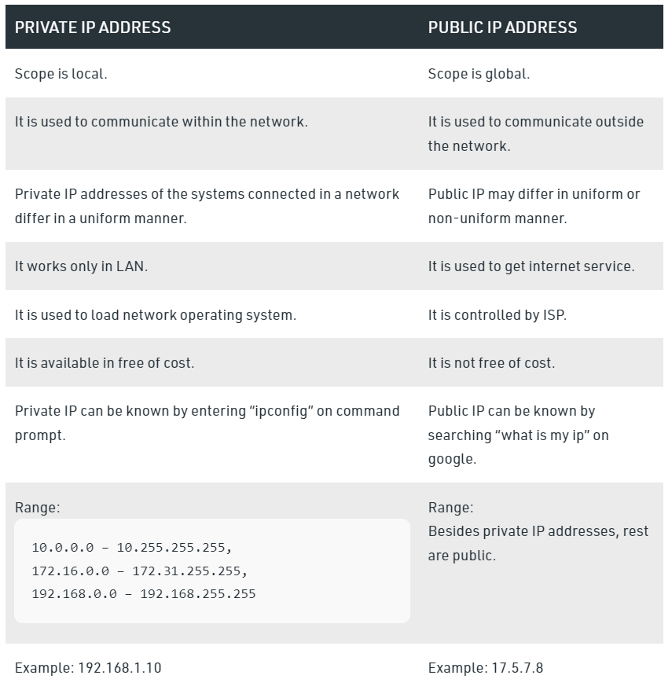

# IP Adressen
IP stands for Internet Protocol, which is a set of standard predefined rules used to govern the way data packets are sent over the internet. For two devices to communicate, they must be able to find each other. For two devices to find each other, their locations must be known to each other. These locations are identified in the computer world as IP addresses. An IP address, which is usually just called an IP, is a series of numbers used to uniquely identify a computer/device on a network or on the internet. The IP address basically indicates the location of a device on a network: it is a unique identifier for devices. This is similar to an address uniquely identifying a house. Every house is identified by a street number (IP address) that can be located on a certain street (network address). As such, two computers cannot have the same IP address on a network.

The addresses facilitate the devices' transmission of messages back and forth to each other. If you want to send an email, stream a video online, or receive a document, your device must have an IP address. Without this, the device cannot effectively communicate with or be located by other devices on the internet.

## Key terminology
An Internet Protocol Address (IP address) refers to a unique address or numerical label designated for each device connected in a computer network using the Internet Protocol (IP) for communication.

Example of an IP address: 192.16.2.1

Simply put, IP addresses identify a device on a local network or the internet and allow data to be transmitted between the devices, containing location information while making devices accessible for easy communication. IP addresses offer a great way of differentiating between different devices like computers, printers, websites, routers, etc.

An IP address is used for two purposes:

- Location finding
- Identifying host/network interface

### Wat betekent IP?  
Het is niets meer dan 'Internet Protocol', en het IP-adres als zodanig is niets meer dan een identificatie. We hebben het over een nummer dat in het netwerk is toegewezen en dat in feite dient om aangesloten apparaten te identificeren. Toch moet je weten dat er twee verschillende soorten IP-adressen zijn: het ip-adres openbaar en privé ip-adres. En nee, hoewel het misschien lijkt dat ze dat zijn, zijn ze niet hetzelfde, maar ook dat beide adressen een totaal andere functie vervullen dan elk ander IP-adres.

### Privé IP-adres
We gaan nu voor het privé-IP-adres dat in feite het adres is dat aan een apparaat is toegewezen, zoals de naam al doet vermoeden, privé. Wat betekent dit? Wat Het is in feite degene die is toegewezen binnen een privénetwerk aan de zijkant van de toegangsdeur dat, als algemene regel, een apparaat zal zijn dat een beetje meer kan klinken voor jou, de router, waar u het goed zult vinden. Als we niet willen dat er een conflict ontstaat in de interne relaties die bestaan ​​tussen elke slimme mobiele telefoon of smartphone, de gameconsoles in uw huis, of dezelfde tv en andere apparaten die u hebt aangesloten, moet u een andere en corresponderend privé IP-adres met een rangorde volgens klasse.
Er zijn drie soorten klassen:

- Klasse a: 10.0.0.0 tot 10.255.255.255.
- Klasse B: 172.16.0.0 tot 172.31.255.255.
- Klasse c: 192.168.0.0 tot 192.168.255.255.

Wat de verschillende klassen van privé-IP-adressen doen, is in feite het mogelijke bereik bepalen dat u kunt toewijzen aan de apparaten die op uw netwerk zijn aangesloten. Meer specifiek wordt klasse A gebruikt voor grote internationale bedrijven, terwijl privé-IP-adressen die binnen klasse B vallen, worden gebruikt voor middelgrote bedrijven en degene die in klasse C blijven, degene zijn die we vaker zullen aantreffen voor thuisnetwerken (zoals uw huis)  en vooral in kleine netwerken vanwege het aantal apparaten dat erop is aangesloten.

Hiermee weten we dat het gebruikelijk is dat in elk huis van een gewone gebruiker het IP-adres 192.168.1.1 standaard is geconfigureerd voor uw router, en dat de privé-IP-adressen zoals 192.168.1.x It wordt gebruikt voor de rest van de apparaten die zijn aangesloten op het lokale netwerk.

### Openbaar IP-adres

Degene die we kennen van het openbare IP-adres is, in feite, degene die de internetserviceprovider (wat wij als telefoniste kennen, elk merk werkt hier voor ons) een klant toewijzen (U kunt de klant zijn). Dit alles helpt ons om apparaten of complete netwerken in het netwerk te identificeren en die in het algemeen de naam dynamisch ip hebben.

De apparaten die clients worden genoemd, zowel computers als mobiele telefoons of smartphones en vele andere die worden gebruikt om op internet te surfen, worden voortdurend op het netwerk geïdentificeerd met een openbaar IP-adres dat voor iedereen zichtbaar is. Naast dit laatste worden ook het statische openbare IP-adres, de servers waarop de pagina's worden gehost en verschillende webservices die we gewend zijn te huren op deze manier geïdentificeerd.

In het laatste geval, van webservers, moeten we zeggen dat er een afhankelijkheid is van de DNS-servers. Omdat de gebruiker in feite een URL-adres in de webbrowser schrijft om de belasting van een webpagina te krijgen (wat we allemaal weten te doen), start de webserver daarna een query naar de DNS-servers die deze ontvangen om deze te verwerken en tenslotte Ze lossen de naam op van wat we weten per domein (adres dat u typt) door het bijbehorende IP-adres te vinden en vervolgens wordt de webpagina die u wilde invoeren op uw scherm geladen om alle webinhoud te bekijken.

Dit openbare IP-adres kent u in de regel niet, maar wordt achter geregistreerd door de DNS-servers dat zijn degenen die het hele proces activeren en ervoor zorgen dat het ene punt samenkomt met het andere zodat u de webinhoud kunt ontvangen.

### Exercise

Ontdek wat je publieke IP adres is van je laptop en mobiel

### Are the IP addresses the same or not? Explain why.

If you are on the internet at home via wifi, your phone has a different ip address than when you connect via the mobile network.

The IP address you have at home is the address assigned to the modem by your internet provider. As a result, all devices that access the internet via that connection have the same IP address for the outside world.

When you connect via your mobile network, you have a different connection, which also includes a different IP address.

You can connect multiple devices to the internet at home via your (Wi-Fi) router at the same time. To the outside world they all have the same (external) IP address. So whether you access the internet via a laptop, game console or smartphone, the IP address remains the same. Your router makes sure that everything goes well.

The IP address that your phone actually has is an internal IP address. This means that the IP address is only visible within your own network. These internal IP addresses are assigned by your (Wi-Fi) router. But from the outside (i.e. from the internet) that internal IP address cannot be seen, but only the external IP address.

### Verander het privé IP adres van je mobiel naar dat van je laptop. Wat gebeurt er dan?

Keep in mind, changing your IP address will temporarily disrupt whatever internet-connected services or programs you're using on your device. There's no harm done, but it's going to have the same effect as if you'd momentarily lost your Wi-Fi.

### The difference between Public and Private IP addresses.

Private IP address of a system is the IP address which is used to communicate within the same network. Using private IP data or information can be sent or received within the same network.

Public IP address of a system is the IP address which is used to communicate outside the network. Public IP address is basically assigned by the ISP (Internet Service Provider).

Difference between Private and Public IP address:

### Sources

[Wat is en hoe het IP-adres van onze mobiel te veranderen?](https://androidguias.com/nl/cambiar-la-ip)

[Difference between Private and Public IP address](https://www.geeksforgeeks.org/difference-between-private-and-public-ip-addresses)

[Was ist eine IP-Adresse?](https://www.avast.com/de-de/c-what-is-an-ip-address)

### Overcome challanges
Finding the right information

I bought the book "Networking for Dummies" at Amazon,and have read it.

