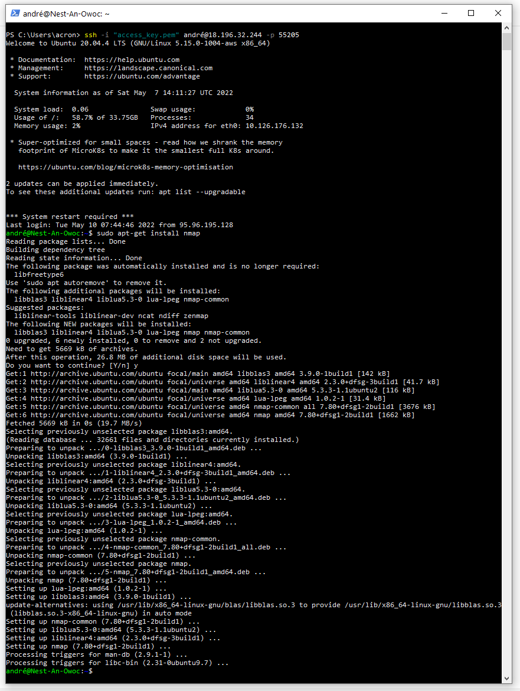

# Network detection
Network detection provides insight into what is happening at each critical point of the network. Details of protocols, traffic flows, and individual data packets can help to keep the network running at optimal levels. With this information, IT teams can identify remote application and network degradations before they become problems. This allows you to manage bandwidth more efficiently, improve availability, and minimize the time it takes to resolve problems through rapid detection and precise isolation.

## Key terminology
Detect and eliminate problems in the network

Spot potential hardware problems early

One of the tasks of an administrator is to check the hardware components of the infrastructure on a daily basis. The performance of the CPU, storage devices, servers and Co. should be consistently high.

## Exercise

## FIRST

Install Nmap on Ubuntu VS

1.- Scan the network of your Linux machine using nmap. What do you find?

Nmap is Linux command-line tool for network exploration and security auditing.

It is used for the following purposes:
- Real time information of a network.
- Detailed information of all the IPs activated on your network.
- Number of ports open in a network.
- Provide the list of live hosts.
- Port, OS and Host scanning.

Quickly check if my website is up.

### Sources
[How to use the NMAP Security Scanner on Linux](https://www.howtoforge.com/tutorial/nmap-on-linux/#on-ubuntu)

### Overcome challanges
[Give a short description of your challanges you encountered, and how you solved them.]

### Results
[Describe here the result of the exercise. An image can speak more than a thousand words, include one when this wisdom applies.]
