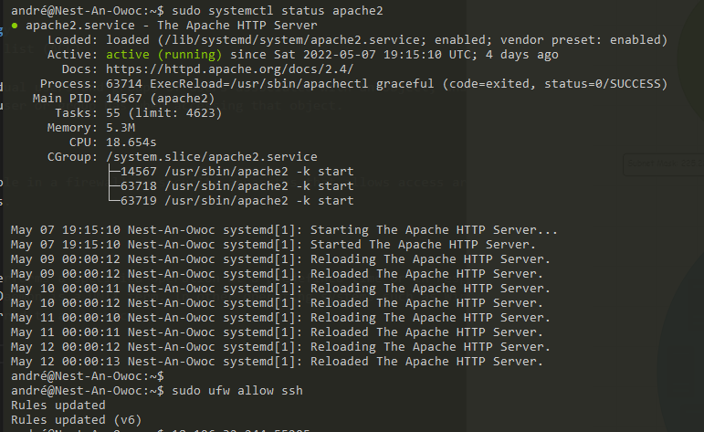
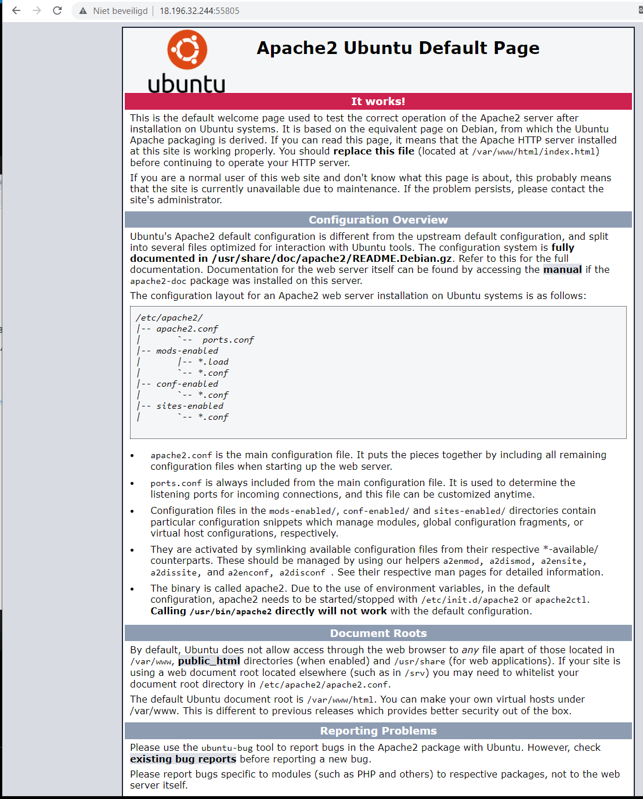

# Firewalls
The quick-and-dirty definition is that a
firewall is a boundary network device that resides between a private network
and the Internet. The firewall is configured to inspect the network traffic that
passes between the Internet and your network and only allows the network
protocols that you desire to pass through the firewall. If a protocol isn’t
included in the approved list, the firewall discards the packets of data and
prevents them from entering the network.

When I hear "Firewalls" I think of a computer geek sitting in the office (in
a darkened closet), with his router and a handy toolkit, tries to keep hackers out.

## Key terminology
- Access control list (ACL)

A list of individual users and groups of users associated with an object, and the rights that the user or group has when accessing that object.

- Back door

An intentional hole in a firewall or security apparatus that allows access around security measures.

- Daemon

A process that performs a specified operation at a predefined time or in response to certain events. Daemon is a UNIX term. In other operating systems such as Windows, daemons are referred to as services.

- Firewall

A security system designed to prevent unauthorized access to or from a private network. Firewalls can be implemented in both hardware and software, or a combination of both.

## Exercise

1. - Install a web server on your VM.

2. - View the default page installed with the web server.

3. - Set the firewall to block web traffic, but allow ssh traffic.

4. - Check if the firewall is doing its job.

### Results

1. Install a web server on your VM.

2. View the default page.

3. Set the firewall.

4. Check the Firewall.

### Sources
[How to use the NMAP Security Scanner on Linux](https://www.howtoforge.com/tutorial/nmap-on-linux/#on-ubuntu)

[UFW Essentials: Common Firewall Rules and Commands](https://www.digitalocean.com/community/tutorials/ufw-essentials-common-firewall-rules-and-commands)

[You need to learn Virtual Machines RIGHT NOW!!](https://www.youtube.com/channel/UC9x0AN7BWHpCDHSm9NiJFJQ)

[Ubuntuusers](https://wiki.ubuntuusers.de/ufw/)

[linuxconfig.org](https://linuxconfig.org/ubuntu-20-04-open-http-port-80-and-https-port-443-with-ufw)

### Overcome challanges

Finding the right information!

