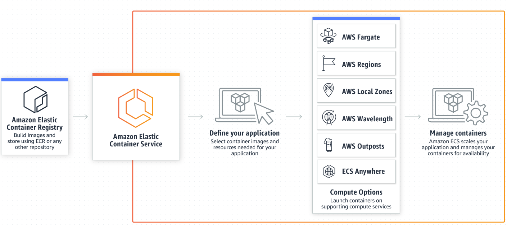

# Amazon Elastic Container Service (Amazon ECS)
---
Amazon Elastic Container Service (ECS) is the name of an Amazon Web Services (AWS) offering.

Amazon ECS is a fully managed container orchestration service that makes it easy for me to deploy, manage, and scale containerized applications.

 It is a scalable, highly available management system for Docker containers. Amazon ECS makes it very easy for applications to run on a managed cluster of Elastic Cloud Computing (EC2) instances. This eliminates the need for a own infrastructure.

 ECS allows me to build and run Docker containers for distributed applications via APIs. 
 
 ECS monitors the CPU and memory utilization to ensure optimal deployment of the containers. 
 
 For further customization, Amazon ECS also supports Elastic Load Balancing, Elastic Block Store, and IAM (Identity and Access Management).

 

 ### Advantages of EFS

 The biggest advantage of the ECS is the fact that it is free. Anyone who pays for certain AWS resources can use the service free of charge. Users who work with the ECS also benefit from these additional advantages:

- Performance at scale

Thousands of Docker containers can be launched in seconds without any additional complexity using Amazon ECS. This is because the service is built on technology that has been developed from years of experiences running highly scalable services.

- Interfaces to start and stop Docker compatible apps.

- Interfaces to query the overall status of your own cluster.

- Access to features such as security groups or elastic load balancing.

- Planning the deployment of the containers in the entire cluster with the necessary resources.

- Security as the clusters are deployed in isolation for each user only.

- Tasks can be defined by the users.

- Automatic recovery system for containers.

### Disadvantages of ECS

There is insufficient documentation of what is happening in the ECS (see sources).

This can become a problem, especially in the case of unexpected events. 

I think building a seamless connection between an ECR system and the ECS is also difficult - especially beginners like me can have problems.

## Key terminology

### Scheduling 

Schedulers place containers over clusters according to the desired resources -- such as RAM or CPU -- and availability requirements. This feature can be used to schedule batch jobs and long-running applications or services.

Amazon ECS includes two schedulers which enable users to deploy containers based on computing needs or availability requirements. AWS Blox, an open source container orchestration tool, integrates with ECS to schedule containers. Long-running applications and batch jobs benefit from the use of schedulers for their responsiveness; ECS also supports third-party scheduling options.

### Docker integration

Docker is supported by Amazon ECS, thus allowing AWS users to manage Docker containers across clusters of Amazon EC2 instances. Each EC2 instance in a cluster runs a Docker daemon that deploys and runs any application packaged as a container locally on Amazon ECS without the need to make any changes to the container.

### Networking

Amazon ECS supports Docker networking as well as integration with Amazon Virtual Private Cloud (Amazon VPC) to provide isolation for containers, thus providing developers with control over how the containers interact with other services and external traffic. Four networking modes are available for the containers; each one supports different use cases. The modes include:

- Host mode

Adds containers directly to the host's network stack and exposes containers on the network that are not isolated.

- Task networking mode

Assigns every running Amazon ECS task a dedicated elastic networking interface which provides the containers with full networking features in Amazon VPC, similar to EC2 instances.

- None mode

Deactivates external networking for containers.

- Bridge mode

Creates a Linux bridge that is used to connect all containers operating on the host in a local virtual network that is accessed through the host's default network connection.

### Cluster management

Amazon ECS handles all of the cluster management processes for the developer. This typically involves installing, operating and scaling cluster management software, monitoring solutions and configuration management systems as well as building the architecture and managing the availability and scalability of each system. With Amazon ECS, the developer simply launches a cluster of container instances and specifies the desired tasks to perform.

### Task Definitions

Tasks can be defined through a declarative JSON template called a Task Definition. The Task Definition allows developers to specify which containers they need for their task, including memory and CPU requirements, Docker repository and images, shared data volumes, as well as choose how the containers are connected to each other. Task Definition files also allow developers to Version control their application specification.

### Load balancing

Integration with the AWS ELB allows developers to distribute traffic across containers. They can specify the Task Definition and ELB to use, and then the Amazon ECS scheduler automatically adds and removes containers using the ELB.

### Repository support

Any third party repository, accessible private Docker registry or Docker Hub can be used with Amazon ECS as long as it is specified in the Task Definition.

### Local development

The AWS CLI allows users to simplify the local development experience and easily set up an Amazon ECS cluster and it related resources. The CLI also supports Docker Compose which is an open source tool used to define and run multi-container applications.

### Programmatic control

Various simple APIs are offered that allow developers to integrate and extend the Amazon ECS service. The APIs enable users to create or delete clusters, launch or destroy Docker containers and register or unregister tasks as well as access detailed information about the state of the cluster and its instances. AWS CloudFormation can also be used to deliver Amazon ECS clusters, register Task Definitions and schedule containers. 

### Logging

Issue diagnosis can be made simpler by sending every container instance's ECS agent logs and Docker container logs to Amazon CloudWatch logs. All Amazon ECS API calls can also be recorded and the log files will be delivered to the user through AWS CloudTrail.

### Monitoring

Monitoring capabilities are provided for the containers and clusters. Average and aggregate CPU can be supervised as well as the memory utilization of running tasks grouped by Task Definition, service or cluster through Amazon CloudWatch. Furthermore, CloudWatch alarms can be set to alert developers whenever a container or cluster needs to be scaled up or down.

### Container deployments

Containers can be easily updated to the newest versions. Whenever a new version of the application Task Definition is uploaded, the Amazon ECS scheduler automatically starts new containers using the updated image and disables any container running on the old version. Amazon ECS will also register and unregister the appropriate new and old containers from the AWS ELB.

### Container auto-recovery

Unhealthy containers are automatically recovered by the Amazon ECS service scheduler. This ensures the necessary number of containers are constantly supporting the application.

## Sources

[What is Amazon Elastic Container Service?](https://docs.aws.amazon.com/AmazonECS/latest/developerguide/Welcome.html)

[Amazon Elastic Container Service (Amazon ECS)](https://aws.amazon.com/ecs/)

[Amazon ECS](https://digitalcloud.training/amazon-ecs-and-eks/)

[What is AWS ECS?](https://cloud.netapp.com/blog/aws-cvo-blg-aws-ecs-in-depth-architecture-and-deployment-options)

## Overcome challanges

Be ready for a ton of tech jargon that you are definitely not going to understand if you are new to this.
